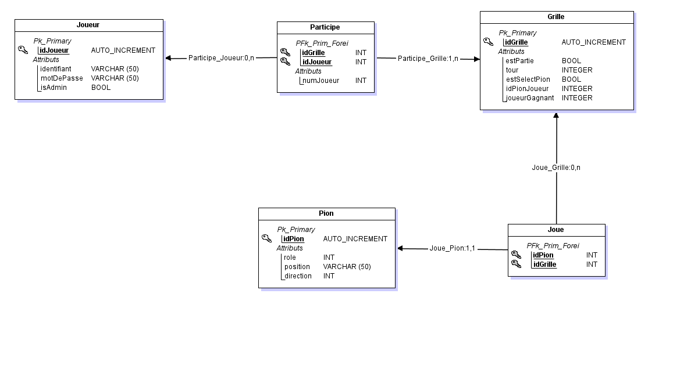

# Projet web: Siam  

## Binôme:  
- Lucas GUERRERO
- Florian LETERTRE

## Scheme Base De Donnée

## Les choix techniques
- Utilisation de ajax pour faire une action dans un partie
- Utilsation de javascript pour une affichage pandant la partie
- Utilisation de PHP pour accéder a la BDD

## L'architecture choisi
- dossier:
  - ressources: dossier avec les images
  - Action: ficher des action dans la partie
  - GestionMenu: fichier de la gestion du menu
- fichier:
  - bdd.php: fichier utilitaire de connexion avec la base de donnée
